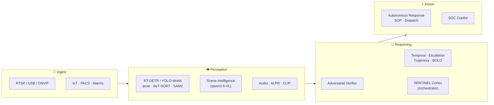

<div align="center">

# 🛡️ SENTIGON

### The Agentic Security Operations Center that runs **100% on your own hardware**

**Turn ordinary camera feeds into an autonomous, reasoning command center — with local AI, zero cloud, and no data ever leaving your network.**

<br/>

[](#-why-sentigon)
[](#-why-sentigon)
[](#-tech-stack)
[](#-tech-stack)
[](#-tech-stack)

[](#-contributing)


<br/>

**[ Why ](#-why-sentigon)** · **[ Features ](#-what-it-actually-does)** · **[ The Console ](#%EF%B8%8F-the-command-center)** · **[ Quick Start ](#-quick-start-5-minutes)** · **[ Architecture ](#%EF%B8%8F-architecture)** · **[ Tech ](#-tech-stack)**

</div>

---

> **TL;DR** — Sentigon ingests live camera feeds and runs them through a fleet of **12 cooperating AI agents** (perception → reasoning → action → supervision) that *detect, verify, reason about, and respond to* physical-security threats in real time. Every model — vision, language, OCR, audio — runs **locally**. There is **no cloud, no API key, no telemetry**. Your footage stays yours.

<br/>

## 🤔 Why Sentigon?

Most "AI security" products are a thin wrapper around a cloud API — your footage leaves the building, you pay per frame, and a "person detected" box is the extent of the intelligence. Sentigon is the opposite:

| | Typical AI surveillance | **Sentigon** |
|---|---|---|
| **Where AI runs** | Someone else's cloud | 🏠 **Your hardware, fully offline** |
| **Your footage** | Uploaded & retained | 🔒 **Never leaves your network** |
| **Cost model** | Per-frame / per-camera SaaS | 💸 **$0 — open & self-hosted** |
| **Intelligence** | Bounding boxes | 🧠 **Agents that reason, verify, and act** |
| **False positives** | You drown in them | ✅ **An adversarial verifier kills them** |
| **Lock-in** | Proprietary | 🔓 **Open, hackable, yours** |

<br/>

## 🚀 What it actually does

A single self-hosted platform that replaces a rack of disconnected tools:

### 👁️ Perception — *see everything*
- **State-of-the-art detection** — RT-DETR (transformer, NMS-free), YOLO11, **YOLO-World open-vocabulary** ("knife", "person on the ground", "fire" by text prompt — no retraining), BoT-SORT re-ID tracking, **SAM2** mask segmentation for occlusion.
- **Structured scene intelligence** — a local vision model (qwen2.5-VL) produces a real **scene graph** (objects, attributes, relationships), captions, activities, and an *evidence-calibrated* threat assessment.
- **Behavior over time** — geometric, hallucination-free temporal detection of **loitering, running, falls** (pose-based), and **abandoned objects** — behaviors that only exist across frames.
- **Real ALPR** (local EasyOCR plate reading) · **audio event detection** (gunshot / glass-break / scream / alarm) · **CLIP** appearance embeddings.

### 🧠 Reasoning — *connect the dots*
- **Adversarial threat verifier** — a second, skeptical AI re-examines every flagged threat and tries to *refute* it. Only the survivors become alerts. This is the single biggest lever against alert fatigue.
- **Escalation chains** — recognizes a *sequence* on one person (loiter → test door → approach) and escalates it long before any single step would.
- **Trajectory prediction**, **cross-camera entity tracking & re-ID**, **real-time BOLO** appearance/plate matching, **semantic "looks-like" forensic search**.
- **Adaptive thresholds** that learn each camera's normal and stop crying wolf in naturally-busy areas.

### ⚡ Action — *do something about it*
- **Autonomous response** pipeline (incident recording → SOP playbook → operator dispatch → emergency-services lookup) with shadow-mode safety.
- **SOC Copilot** — an agentic, tool-using chat that answers *"what's happening on the loading dock right now?"* with a reasoned, data-grounded answer.
- **SOP execution**, **compliance forecasting**, **predictive analytics**, **red-team self-testing**.

### 🔭 Supervision
- A **SENTINEL Cortex** agent orchestrates the fleet, maintains the security posture, issues directives, and synthesizes shift briefings.

<br/>

## 🖥️ The Command Center

A purpose-built **mission-control** interface — not a generic admin dashboard. Deep layered surfaces, monospaced telemetry, glowing status LEDs, a live command bar, and real-time agent feeds across **60+ operational views**.

<!-- 📸 Add a screenshot / GIF of the dashboard here for maximum impact:
      -->

> _Spin it up (below) and open `http://localhost:3000` to see it live._

<br/>

## ⚡ Quick Start (5 minutes)

Sentigon runs on **bare metal** — no Docker required. Everything (Postgres, Redis, Qdrant, the backend, and the frontend) comes up with one script.

**Prerequisites:** Python 3.12 · Node 20+ · [Ollama](https://ollama.com) · (a GPU is recommended but not required)

```bash
# 1. Clone
git clone https://github.com/Sherin-SEF-AI/Sentigon.git
cd Sentigon

# 2. Pull the local models (the only "download" you need — no API keys, ever)
ollama pull qwen2.5:7b      # reasoning / language
ollama pull qwen2.5vl:7b    # vision

# 3. Backend deps (into a venv)
python3.12 -m venv .venv && source .venv/bin/activate
pip install -r requirements.txt

# 4. Frontend deps
cd frontend && npm install && cd ..

# 5. Launch the entire stack
bash start-local.sh
```

Then open **`http://localhost:3000`** and log in:

```
Email:    admin@sentinel.local
Password: changeme123          ← change this before exposing it anywhere
```

> The backend serves on `:8002`. On first boot it auto-runs migrations, seeds 165+ threat signatures, loads the detector + agents, and registers any available cameras. Add an RTSP/USB camera from **Settings → Cameras**.

<br/>

## 🏗️ Architecture

<div align="center">

</div>

A layered **perception → reasoning → action → supervision** pipeline:



Every box runs **locally**. The LLMs are Ollama (`qwen2.5` / `qwen2.5-VL`); the detectors are ultralytics (RT-DETR / YOLO / SAM2); embeddings are CLIP. No external inference calls.

<br/>

## 🧩 Tech Stack

**Backend** — FastAPI (async) · SQLAlchemy 2.0 + asyncpg · PostgreSQL · Qdrant (vectors) · Redis · Celery · Alembic · JWT/bcrypt · Prometheus + structlog
**AI / CV** — Ollama (qwen2.5 / qwen2.5-VL) · ultralytics (RT-DETR, YOLO11, YOLO-World, pose, SAM2, BoT-SORT) · CLIP · EasyOCR · librosa · OpenCV
**Frontend** — Next.js 16 (App Router) · React 19 · TypeScript · Tailwind CSS v4 · Radix UI · Recharts · Leaflet

<details>
<summary><b>📂 Deep dive — agents, services, and the full feature set</b> (click to expand)</summary>

<br/>

### The agent fleet (12)
**Perception:** Watcher · Detector · Audio Sentinel — **Reasoning:** Threat Analyzer · Tracker · Investigator — **Action:** Responder · Reporter — **Supervision:** SENTINEL Cortex — **Specialized:** Access Guardian · Environmental · Red Team.

Agents communicate over Redis pub/sub channels and call internal tools through a local LLM function-calling loop.

### Notable services
`scene_intelligence` · `threat_verifier` · `temporal_behavior` · `escalation_tracker` · `trajectory_predictor` · `sam_segmenter` · `alpr_service` · `audio_detection_service` · `bolo_matcher` · `adaptive_thresholds` · `baseline_learning` · `autonomous_response` · `sop_engine` · `compliance` (with forecasting) · `forensic_search` (semantic) · `feedback_tuning` · `entity_tracker` · `context_fusion`.

### Surface area
- **60+ frontend views** across Operations, Alerts & Response, Investigation, Detection & AI, Threat Management, Access & Patrol, Analytics & Maps, Compliance, and System.
- **Hundreds of API endpoints**, WebSocket live feeds, RBAC (admin / analyst / operator / viewer), audit logging, and multi-tenant scaffolding.

</details>

<br/>

## 🗺️ Roadmap

- [ ] One-command installer & prebuilt model bundle
- [ ] Live multi-camera demo dataset
- [ ] Deep audio model (PANNs / YAMNet) drop-in to replace the DSP classifier
- [ ] Mask-based occlusion **re-acquisition** (SAM2 video memory)
- [ ] Edge deployment guide (Jetson / mini-PC)

<br/>

## 🤝 Contributing

Issues, ideas, and PRs are very welcome — a new detector, an agent skill, a UI polish pass, or docs. Open an issue to start a conversation.

<div align="center">

### If a private, local-first, agentic SOC is something the world should have —

# ⭐ Star the repo

It genuinely helps, and it's the fastest way to follow where this goes.

<br/>

**Built for operators who refuse to send their footage to someone else's cloud.**

</div>
